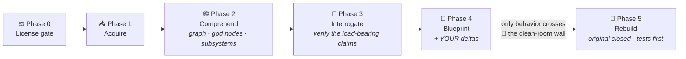

<div align="center">


# 🔨 reforge

### Understand any repo. Rebuild it **yours**.

[](LICENSE)
[](skills/reforge/SKILL.md)
[](https://claude.com/claude-code)
[](https://github.com/safishamsi/graphify)
[](#%EF%B8%8F-why-clean-room)
[](https://github.com/GerardoRdz96/reforge/pulls)

**reforge** is an agent skill that reverse-engineers any open-source repository into<br>
🧠 the cleanest possible explanation of how it actually works, and<br>
📐 a behavioral blueprint you can rebuild from — **with your changes, in your stack, clean-room.**

</div>

---

> 🛑 Stop reading 60k lines to understand a tool.
> 🍴 Stop forking when what you wanted was *your own version*.

```text
you:    /reforge https://github.com/karpathy/micrograd — but in TypeScript, with a graph visualizer

agent:  ⚖️  license gate ........ MIT ✓
        🕸️  knowledge graph ..... 55 nodes · 86 edges · god nodes: Value, Neuron, Layer, MLP
        🧠  UNDERSTANDING.md .... the repo, explained clean — load-bearing pieces, data flow, the core trick
        📐  BLUEPRINT.md ........ a spec you could build from without ever seeing the source
        🔨  rebuild/ ............ your TypeScript version, clean-room, tests first
```

## ⚡ Install

Works with **Claude Code** (and any agent that reads [skills](https://github.com/anthropics/skills)):

```bash
npx skills add GerardoRdz96/reforge
```

🕸️ Optional but recommended — the graph engine that makes the understanding pass exceptional ([graphify](https://github.com/safishamsi/graphify), 65k★):

```bash
uv tool install graphifyy   # double-y! code analysis is local & free (tree-sitter)
```

Without graphify, reforge falls back to manual repo mapping. With it: god-node detection, auto-named subsystems, surprising-connection analysis, and token-cheap graph queries.

## 🎁 What you get

| | Artifact | What it is |
|---|---|---|
| 🧠 | **`UNDERSTANDING.md`** | The repo explained the way you wish its docs did: the 5 load-bearing pieces, each subsystem, one request traced end-to-end, the non-obvious couplings. Every claim labeled `[VERIFIED]` or `[INFERRED]`. |
| 📐 | **`BLUEPRINT.md`** | A behavioral spec — mechanisms, contracts, build order, test strategy — plus **your customization deltas**. Someone who never saw the original could build from it. That someone is your agent. |
| 🔨 | **`rebuild/`** | Your version. Clean-room: built from the blueprint with the original source closed. Ships with `ATTRIBUTION.md`. |

## 🗺️ How it works



1. **⚖️ License gate** — SPDX check before anything else; unlicensed code never gets a rebuild.
2. **🕸️ Comprehend** — graphify builds a knowledge graph (locally, free for code); the skill turns god nodes + communities + surprising connections into `UNDERSTANDING.md`.
3. **🔎 Interrogate** — the agent answers what a rebuilder must know (the core trick, the contracts, what breaks at 10×), verifying inferred claims against real code.
4. **📐 Blueprint** — asks what YOU want different, then writes the spec with your deltas designed in.
5. **🔨 Rebuild** — fresh repo, original closed, blueprint only, tests first.

## 📚 Worked example

[`examples/micrograd/`](examples/micrograd/) — karpathy's micrograd (12k★) reforged end-to-end:

- 🧠 [`UNDERSTANDING.md`](examples/micrograd/UNDERSTANDING.md) — the autograd engine explained in 6 sections, from a real 55-node graph run ($0)
- 📐 [`BLUEPRINT.md`](examples/micrograd/BLUEPRINT.md) — "gradflow": the TypeScript + built-in-visualizer rebuild spec

## 🛡️ Why clean-room?

reforge is built to keep you on the right side of open source:

- ⚖️ **Phase 0 license gate** — checks the target's license first; refuses rebuilds of unlicensed code.
- 🧱 **The blueprint wall** — only *behavioral descriptions* cross from the original to your rebuild. Never code. Your implementation is original work.
- 🔓 **Copyleft awareness** — GPL/AGPL targets come with a warning and a recommendation that your rebuild stay open.
- 🙏 **Attribution by default** — every rebuild credits the original design.

This is how engineers have legally reimplemented systems for decades (Compaq vs IBM BIOS, 1982). reforge just makes the discipline automatic.

## ❓ FAQ

<details>
<summary><b>Is this just "fork it"?</b></summary>
<br>No. A fork keeps their code, their architecture, their language, their debt. reforge gives you their <i>lessons</i> in a spec, and a version that's actually yours.
</details>

<details>
<summary><b>Is this legal?</b></summary>
<br>Understanding public code is legal everywhere. Clean-room reimplementation from a behavioral spec is the industry-standard legal path. The license gate + blueprint wall keep the discipline honest. (Not legal advice; if you're rebuilding something commercial-sensitive, ask a lawyer.)
</details>

<details>
<summary><b>Does it work on huge repos?</b></summary>
<br>Yes — pick one subsystem from the community list and reforge that. The graph makes subsystem boundaries visible.
</details>

<details>
<summary><b>Which agents?</b></summary>
<br>Claude Code first-class. The skill is plain markdown — Codex, Cursor, Gemini CLI and friends can run it too.
</details>

---

<div align="center">

⭐ **If reforge saved you a weekend of code-reading, star the repo — it helps others find it.** ⭐

MIT · Built by 🐧 [The Penguin Alley](https://penguinalley.com) · Powered by [graphify](https://github.com/safishamsi/graphify)

</div>
